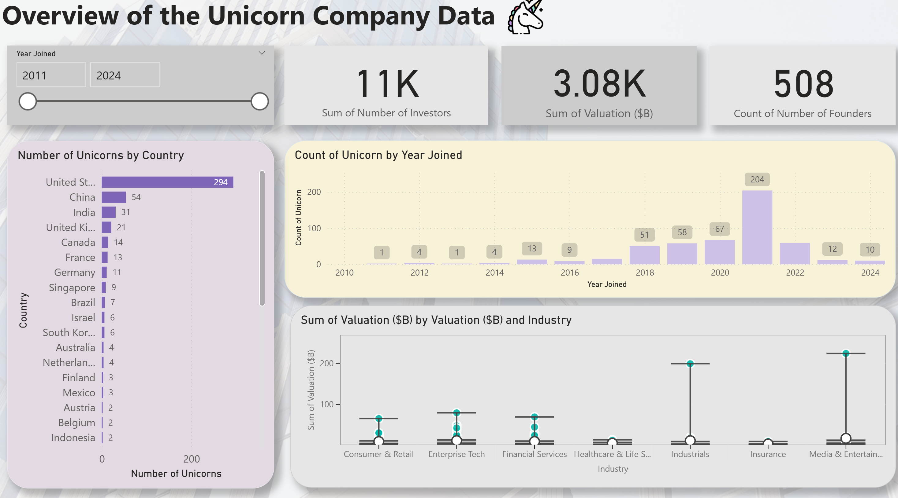
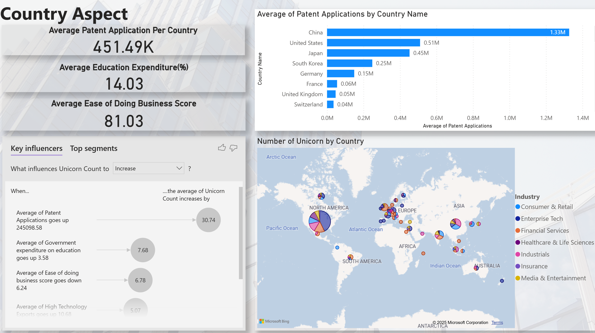
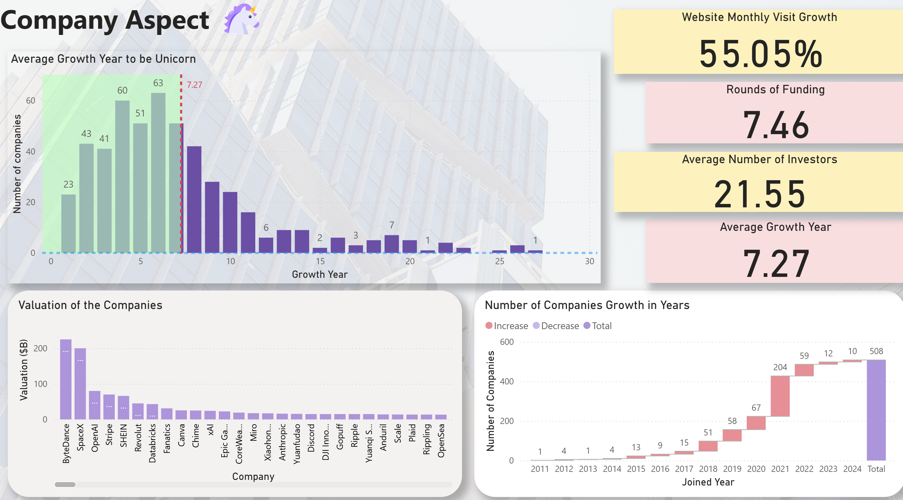
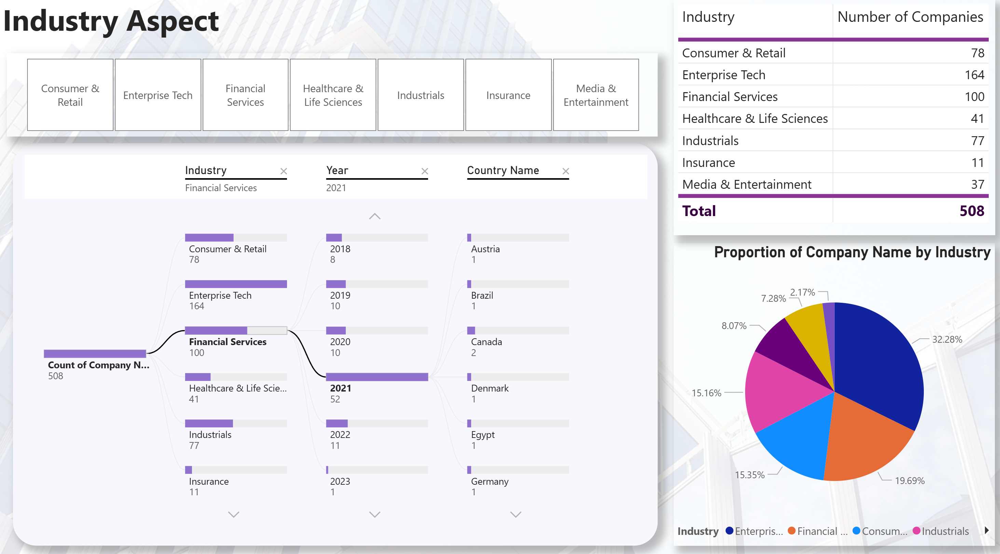
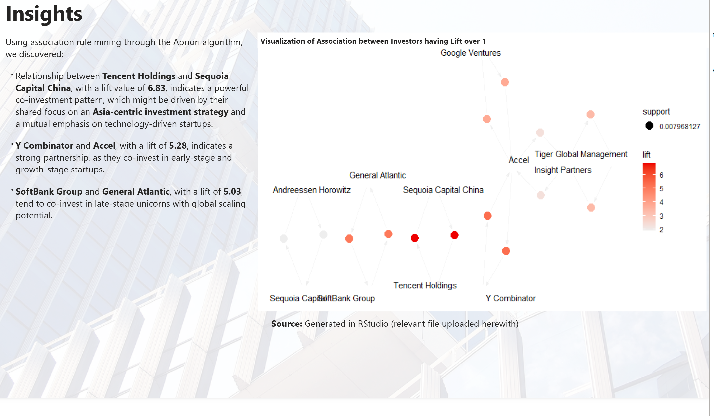
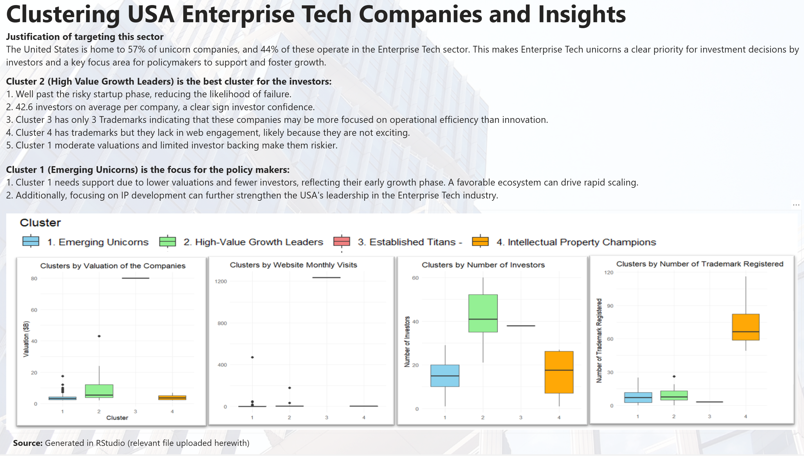

# Project Unicorn

---
Title: "Unicorn Company Analysis — Unsupervised Machine Learning"
subtitle: "Clustering, VC co-investment networks, and policy/investor insights"
date: 2025-08-27
lastmod: 2025-08-27
draft: false
summary: "Analyzed 500+ unicorns across 38 countries using Apriori association rules and clustering (PCA). Built interactive Power BI dashboards and R visualizations to surface investor alliances and company profiles for action by investors and policymakers."
tags: ["Power BI", "R", "Python", "Apriori", "Clustering", "PCA", "World Bank", "CB Insights", "Crunchbase"]
categories: ["Analytics", "Machine Learning", "Business Intelligence"]
authors: ["Md Rajib Hossain"]
cover:
  image: "/images/unicorns/cover-dashboard.png"   # <- replace with your screenshot path
  alt: "Overview dashboard of the unicorn analysis"
  caption: "Overview of Unicorns: country, year joined, investors, and valuation"
  relative: true
resources:
  - name: "overview"
    src: "overview-dashboard.png"
  - name: "country"
    src: "country-aspect.png"
  - name: "company"
    src: "company-aspect.png"
  - name: "industry"
    src: "industry-aspect.png"
  - name: "associations"
    src: "investor-association.png"
  - name: "clusters"
    src: "usa-enterprise-tech-clusters.png"
---

> **TL;DR**  
> I built an end-to-end analysis of the global unicorn ecosystem (startups valued at \$1B+), integrating company-level data with country indicators. Using **Apriori association rules** I uncovered VC **co-investment networks**, and via **clustering + PCA** I profiled distinct unicorn groups to guide **investor** and **policy** decisions. Results are delivered through **Power BI dashboards** and **R visualizations**.

---

## 🔍 Objectives
- Map and profile unicorns across **countries, industries, valuation, growth year, founders, and investors**.  
- Identify **VC co-investment patterns** with association rule mining (lift/support/confidence).  
- Segment companies with **unsupervised learning** to surface investable clusters and policy targets.  
- Build **interactive dashboards** for exploration and stakeholder storytelling.

---

## 🗂️ Data
**Company sources**
- CB Insights — Unicorn tracker (as of Sept 2024)
- Crunchbase — Company metadata and investors

**Country indicators (World Bank)**
- GDP, Ease of Doing Business, Government Education Expenditure (%)
- Patent Applications, High-Tech Exports (% manuf. exports)
- Medium & High-Tech Manufacturing Value Added (%)

> 500+ unicorns, 38 countries, 40+ features. 2019 chosen as baseline for minimal missingness.

---

## 🛠️ Workflow
1. **Collection**
   - Web-scraped 40+ variables with *Instant Web Scraper*.
2. **Cleaning & Integration**
   - Python (pandas) + Excel + Power BI for typing, normalization, joins (by **country** and **company**).
3. **Modeling & Analytics**
   - **Apriori** (R: `arules`, `arulesViz`) for investor association rules (lift > 1, support > 0.007, confidence > 0.05).
   - **PCA + clustering** (R) for unicorn segmentation (valuation, investors, trademarks, engagement).
4. **Visualization**
   - **Power BI** dashboards (overview, country, company, industry).
   - **R/plotly** 3D rule plots, **network graphs** of co-investments.

---

## 📈 Key Findings
- **Global overview:** 507 unicorns across 38 countries; surge in **2021**.  
- **Industry mix:** **Enterprise Tech ~32.5%**, **Financial Services ~19.5%**, **Consumer & Retail ~15%**.  
- **Top geographies:** United States (dominant), China, India.

**VC Co-investment (Apriori)**
- **Tencent ↔ Sequoia Capital China** — Lift **6.83** (strong Asia-centric alignment).  
- **Y Combinator ↔ Accel** — Lift **5.28** (early/growth-stage focus).  
- **SoftBank ↔ General Atlantic** — Lift **5.03** (late-stage scaling).

**Clusters (PCA + clustering)**
- **C1: Emerging Unicorns** — lower valuation, fewer investors → *policy support target*.  
- **C2: High-Value Growth Leaders** — higher valuation, strong investor confidence → *prime for investors*.  
- **C3: Established Titans** — very high valuation, few trademarks (execution > innovation).  
- **C4: IP Champions** — strong patents/trademarks, lower web engagement.

**Implications**
- **Investors:** Prioritize **Cluster 2** for balanced risk-return.  
- **Policy makers:** Enable **Cluster 1** (capital access, IP development, talent & market access).  
- **Strategy:** US + Enterprise Tech remains the high-leverage focus.

---

## 🧭 Dashboards & Visuals

> If your theme doesn’t support the `figure` shortcode, replace the blocks above with standard Markdown:  
> ``

---

## 🧪 Tech Stack
- **Data:** Python (pandas, numpy), Excel  
- **ML/Stats:** R (`arules`, `arulesViz`), PCA, clustering  
- **Viz:** Power BI, R `plotly` / network graphs  
- **Other:** Instant Web Scraper (Chrome)

---

## ▶️ How to Reproduce (High-Level)
1. Export unicorn & investor tables from CB Insights / Crunchbase.  
2. Download World Bank indicators (2019) and normalize country names/codes.  
3. Run cleaning & merge script (`/notebooks/Data_Cleaning_using_Python.ipynb`).  
4. Generate association rules and cluster models in R (`/R/analysis.R`).  
5. Load curated tables into Power BI (`/bi/Unicorns.pbix`) for dashboards.

> This repo contains **screenshots** and **model scripts**. Some raw sources require vendor access (CBI/Crunchbase).

---

## 📜 License & Credits
- Data © respective owners (CB Insights, Crunchbase, World Bank).  
- Analysis & visuals © **Md Rajib Hossain**.  
- For academic presentation: BUSINFO 703, University of Auckland (Nov 2024).

---

## 📬 Contact
- GitHub: **@GitRajib1230**  
- LinkedIn: YOUR_LINKEDIN_URL  
- Email: YOUR_EMAIL
